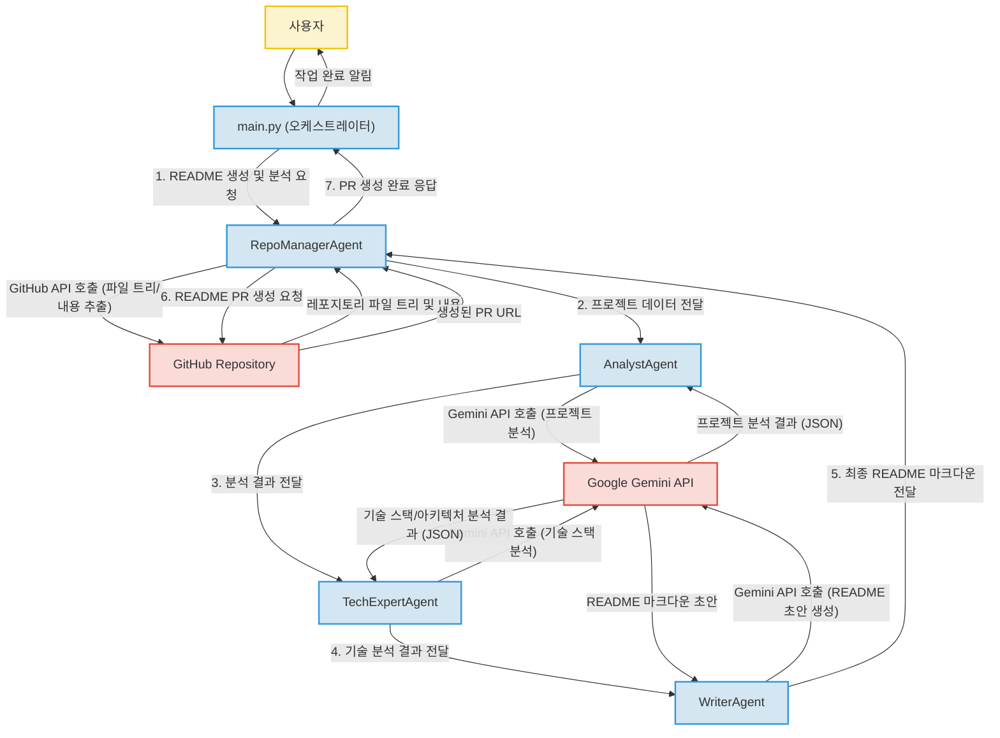

# Unknown Project

---

## 프로젝트 소개

이 프로젝트는 GitHub 레포지토리의 내용을 분석하여 자동으로 README.md 파일을 생성하고, 이를 해당 레포지토리에 Pull Request(PR) 형태로 제출하는 지능형 에이전트 기반 시스템입니다. 'RepoManager', 'Analyst', 'TechExpert', 'Writer'라는 네 가지 핵심 에이전트가 Google Gemini API와 GitHub API를 활용하여 협력하며, 레포지토리 정보 추출부터 코드 분석, 기술 스택 파악, README 초안 생성, 최종 PR 제출까지의 전 과정을 자동화합니다.

본 프로젝트는 오픈소스 프로젝트의 초기 문서화 과정을 간소화하고, 개발자들이 핵심 개발에 집중할 수 있도록 지원하는 것을 목표로 합니다.

## 주요 기능

*   **자동화된 README 생성**: GitHub 레포지토리의 소스 코드를 분석하여 프로젝트의 핵심 정보를 담은 README.md 파일을 자동으로 생성합니다.
*   **에이전트 기반 모듈화 설계**: 각 에이전트(RepoManager, Analyst, TechExpert, Writer)가 특정 역할을 담당하도록 설계되어 시스템의 확장성과 유지보수성을 높였습니다.
*   **LLM(대규모 언어 모델) 활용**: Google Gemini API를 활용하여 복잡한 코드 분석, 기술 스택 식별, 그리고 자연스러운 문장으로 구성된 문서 생성 등 지능적인 작업을 수행합니다.
*   **GitHub API 연동**: GitHub API를 통해 대상 레포지토리의 파일 트리와 내용을 추출하고, 최종적으로 생성된 README를 Pull Request 형태로 제출하여 전체 워크플로우를 자동화합니다.
*   **보안 환경 설정**: `python-dotenv`를 사용하여 API 키와 같은 민감 정보를 안전하게 관리하고 개발 환경의 보안을 강화합니다.
*   **표준화된 개발 환경**: `.devcontainer` 및 GitHub 템플릿을 제공하여 개발 환경의 일관성을 확보하고 새로운 기여자들이 쉽게 프로젝트에 참여할 수 있도록 지원합니다.

## 프로젝트 구조

디렉토리 구조 정보는 제공되지 않았습니다.

## 핵심 파일 설명

핵심 파일에 대한 구체적인 설명은 제공되지 않았습니다.

## 기술 스택

이 프로젝트는 다음과 같은 기술 스택을 활용하여 개발되었습니다.

*   **Backend**:
    *   **Python**: 다재다능한 파이썬을 활용하여 에이전트들의 복잡한 로직을 효율적으로 구현하고 시스템을 빠르게 개발할 수 있었습니다.
*   **AI/ML**:
    *   **Google Gemini API**: 최신 대규모 언어 모델인 Gemini API를 활용하여 고도화된 코드 분석, 기술 스택 파악 및 README 초안 생성 능력을 구현할 수 있었습니다.
*   **DevOps & Utilities**:
    *   **PyGithub**: 파이썬으로 GitHub API를 직접 제어하여 레포지토리 정보 추출부터 PR 생성까지 자동화된 워크플로우를 구축할 수 있었습니다.
    *   **python-dotenv**: 환경 변수를 안전하게 관리하여 API 키 등 민감 정보를 코드에서 분리하고 보안을 강화할 수 있었습니다.
    *   **GitHub**: GitHub 플랫폼의 기능을 활용하여 프로젝트 소스 코드를 효율적으로 관리하고, 자동화된 README PR 제출을 통해 개발 및 문서화 프로세스를 통합했습니다.
    *   **Dev Container**: 개발 환경을 표준화하고 온보딩 프로세스를 간소화하여 팀원들이 일관된 환경에서 개발할 수 있도록 지원했습니다.

## 시스템 아키텍처

이 프로젝트는 GitHub 레포지토리를 분석하여 README를 자동 생성하고 PR로 제출하는 에이전트 기반 시스템입니다. 'RepoManager', 'Analyst', 'TechExpert', 'Writer' 네 가지 핵심 에이전트가 순차적으로 협업하며, 각 에이전트는 Google Gemini API를 활용하여 지능적인 분석 및 문서 생성 작업을 수행합니다. GitHub API를 통해 대상 레포지토리에서 데이터를 추출하고, 최종적으로 생성된 README를 PR 형태로 게시하는 엔드-투-엔드 자동화 워크플로우를 구성하고 있습니다.

전체 시스템 아키텍처는 다음 다이어그램과 같습니다.

1.  **사용자 (User)**: `main.py`를 통해 README 생성 및 분석을 요청합니다.
2.  **`main.py` (오케스트레이터)**: 전체 워크플로우를 조율하고 각 에이전트의 실행을 관리합니다.
3.  **`RepoManagerAgent`**:
    *   GitHub API를 호출하여 대상 레포지토리의 파일 트리와 내용을 추출합니다.
    *   추출된 프로젝트 데이터를 `AnalystAgent`에게 전달합니다.
    *   최종 생성된 README 마크다운을 받아 GitHub에 PR 생성을 요청하고, PR 생성 완료 응답을 `main.py`에 전달합니다.
4.  **`AnalystAgent`**:
    *   `RepoManagerAgent`로부터 받은 데이터를 바탕으로 Google Gemini API를 호출하여 프로젝트를 분석합니다.
    *   분석 결과를 `TechExpertAgent`에게 전달합니다.
5.  **`TechExpertAgent`**:
    *   `AnalystAgent`의 분석 결과와 Google Gemini API를 활용하여 프로젝트의 기술 스택 및 아키텍처를 상세히 분석합니다.
    *   기술 분석 결과를 `WriterAgent`에게 전달합니다.
6.  **`WriterAgent`**:
    *   `TechExpertAgent`의 기술 분석 결과를 바탕으로 Google Gemini API를 호출하여 README 마크다운 초안을 생성합니다.
    *   생성된 README 초안을 `RepoManagerAgent`에게 전달합니다.
7.  **GitHub Repository**: 실제 GitHub 레포지토리로, 파일 내용 추출 및 Pull Request 생성의 대상이 됩니다.
8.  **Google Gemini API**: 각 에이전트의 지능적인 분석 및 문서 생성 작업을 지원하는 대규모 언어 모델입니다.

## 실행 방법

실행 방법에 대한 정보가 제공되지 않았습니다. 추가 작성 필요.

## 기술 선택 이유

*   **Python**: 다양한 라이브러리와 프레임워크를 지원하며, 생산성이 높아 복잡한 에이전트 로직을 빠르고 효율적으로 구현하는 데 적합합니다.
*   **Google Gemini API**: 최신 대규모 언어 모델로서 뛰어난 이해력과 생성 능력을 바탕으로 고품질의 코드 분석 및 README 초안 생성을 가능하게 합니다.
*   **PyGithub**: GitHub API를 파이썬 친화적인 방식으로 쉽게 제어할 수 있게 하여 레포지토리 정보 추출, PR 생성 등 GitHub 관련 작업을 효율적으로 자동화할 수 있습니다.
*   **python-dotenv**: 환경 변수를 사용하여 민감한 API 키와 같은 정보를 코드와 분리함으로써 보안을 강화하고, 다양한 환경에서 유연하게 설정값을 관리할 수 있도록 돕습니다.
*   **GitHub**: 전 세계적으로 가장 널리 사용되는 코드 호스팅 플랫폼으로, 프로젝트의 소스 코드 관리, 협업, 그리고 자동화된 PR 제출을 통한 문서화 프로세스 통합에 필수적입니다.
*   **Dev Container**: 개발 환경을 컨테이너 기반으로 표준화하여 팀원 간 개발 환경 불일치 문제를 해소하고, 온보딩 시간을 단축하여 생산성을 향상시킵니다.

## 개선 방향

현재 프로젝트에서 구체적으로 정의된 개선 방향은 없습니다. 하지만 에이전트 기반 LLM 프로젝트의 일반적인 발전 방향을 고려할 때, 다음과 같은 개선이 가능할 것으로 예상됩니다 (추정):

*   **사용자 피드백 루프 통합**: 생성된 README에 대한 사용자 피드백을 수집하고 이를 모델 학습 또는 에이전트 로직 개선에 활용하여 생성 품질을 지속적으로 향상시킬 수 있습니다.
*   **다국어 지원 확장**: 현재 한국어 README 생성에 중점을 두는 것으로 보이나, 영어, 일본어 등 다양한 언어로 README를 생성할 수 있도록 기능을 확장하여 글로벌 프로젝트에 기여할 수 있습니다.
*   **세부 분석 기능 고도화**: 특정 프레임워크(예: Django, React)나 라이브러리 사용 패턴, 아키텍처 설계 원칙 등을 더욱 깊이 분석하여 README에 포함되는 정보의 깊이와 정확성을 높일 수 있습니다.
*   **커스터마이징 옵션 제공**: 사용자 또는 프로젝트 관리자가 README의 특정 섹션이나 스타일, 포함할 내용 등에 대한 가이드라인을 제공하여 생성 결과의 유연성을 높일 수 있습니다.
*   **CLI 또는 웹 UI 제공**: 현재 `main.py`를 통한 실행으로 추정되나, 사용자가 더 쉽고 직관적으로 프로젝트를 활용할 수 있도록 Command Line Interface(CLI) 도구나 간단한 웹 사용자 인터페이스(UI)를 제공할 수 있습니다.