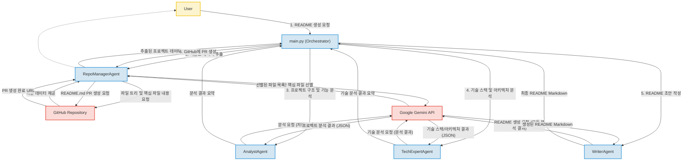

# READM_Agent (추정)

이 문서는 `grassandtree/READM_Agent` GitHub 저장소의 프로젝트를 분석하고 정리한 README.md 파일입니다. 이 프로젝트는 LLM 기반 에이전트 시스템을 활용하여 GitHub 저장소의 README.md 문서를 자동으로 생성하고 업데이트하는 것을 목표로 합니다.

## 프로젝트 소개

`READM_Agent`는 GitHub 저장소의 README.md 파일을 자동으로 생성하고 업데이트하는 지능형 에이전트 시스템입니다. 본 프로젝트는 다양한 전문 에이전트들이 협력하여 저장소 분석부터 기술 스택 파악, 시스템 아키텍처 도출, 최종 문서 작성에 이르는 전 과정을 자동화합니다.

*   **저장소 URL**: [https://github.com/grassandtree/READM_Agent](https://github.com/grassandtree/READM_Agent)
*   **한 줄 요약**: LLM 기반 에이전트를 활용하여 GitHub 저장소의 README.md 문서를 자동으로 생성하고 업데이트하는 시스템.

## 주요 기능

`READM_Agent`는 다음과 같은 주요 기능을 제공합니다.

*   **저장소 데이터 추출**: GitHub API를 통해 저장소의 파일 트리 및 핵심 파일 내용을 자동으로 추출합니다.
*   **지능형 파일 선별**: LLM(Google Gemini)을 활용하여 프로젝트의 핵심 파일을 지능적으로 선별합니다.
*   **프로젝트 분석**: 저장소 데이터를 바탕으로 프로젝트의 목적, 디렉토리 구조, 주요 기능 등을 분석합니다.
*   **기술 스택 및 아키텍처 분석**: 프로젝트의 기술 스택을 식별하고, 시스템 아키텍처를 분석하여 Mermaid.js 형식의 다이어그램을 생성합니다.
*   **README.md 문서 자동 생성**: 분석된 모든 정보를 종합하여 완성도 높은 README.md 문서를 생성하며, 문서의 톤을 설정할 수 있습니다.
*   **GitHub Pull Request 발행**: 생성된 README.md 문서를 해당 GitHub 저장소에 Pull Request로 게시합니다.

## 프로젝트 구조

프로젝트는 모듈화된 파이썬 스크립트와 에이전트 구성을 중심으로 설계되었습니다.

```
.
├── agents/
│   ├── analyst.py
│   ├── repo_manager.py
│   ├── tech_expert.py
│   ├── writer.py
│   └── prompts/
│       ├── ... (LLM 프롬프트 파일들)
├── tools/
│   ├── github_api.py
│   └── ... (추정: parser.py, doc_gen.py 등)
├── main.py
├── requirements.txt
└── .env (환경 변수 파일, .gitignore에 포함)
```

## 핵심 파일 설명

이 프로젝트의 핵심 파일과 그 역할은 다음과 같습니다.

*   `main.py`: 프로젝트의 진입점이자 전체 워크플로우를 오케스트레이션하는 파일입니다. 환경 변수 로드, 각 에이전트 초기화, 그리고 에이전트 간의 순차적인 호출을 통해 README 생성 과정을 조율합니다.
*   `agents/repo_manager.py`: GitHub API를 통해 저장소의 파일 트리와 핵심 파일 내용을 추출하는 역할을 합니다. LLM을 사용하여 어떤 파일이 중요한지 지능적으로 판단하며, 최종적으로 생성된 README를 GitHub에 Pull Request로 게시하는 기능도 수행합니다.
*   `agents/analyst.py`: `repo_manager`가 수집한 데이터를 바탕으로 프로젝트의 전반적인 목적, 디렉토리 구조, 주요 기능 등을 분석합니다. 그 결과를 구조화된 JSON 형태로 반환하여 다음 단계 에이전트의 입력으로 사용됩니다.
*   `agents/tech_expert.py`: `analyst`의 분석 결과를 토대로 프로젝트의 기술 스택과 시스템 아키텍처를 상세하게 분석합니다. 기술 선택의 이점과 함께 Mermaid.js 형식의 아키텍처 다이어그램을 생성하는 데 특화되어 있습니다.
*   `agents/writers.py`: `analyst`와 `tech_expert` 에이전트의 최종 분석 결과를 취합하여 최종 README.md 문서를 생성합니다. 문서의 톤(mode)을 설정하여 대상 독자에 맞는 README를 작성할 수 있습니다.
*   `agents/prompts/*.py`: 이 디렉토리 내의 파일들은 각 에이전트가 Gemini LLM과 소통할 때 사용하는 명령(instruction)과 입력 템플릿을 정의합니다. 이 프롬프트들은 LLM의 '행동'과 '응답 형식'을 결정하는 가장 중요한 설정 파일들입니다.
*   `tools/github_api.py`: GitHub API를 파이썬으로 쉽게 사용할 수 있도록 래핑한 유틸리티 모음입니다. 저장소 정보 가져오기, 파일 내용 읽기, Pull Request 생성 등의 저수준(low-level) 기능을 추상화하여 제공합니다.
*   `requirements.txt`: 이 프로젝트를 실행하는 데 필요한 모든 Python 라이브러리(`google-generativeai`, `PyGithub`, `python-dotenv` 등)의 목록을 명시합니다. 이를 통해 환경 설정 및 배포 시 필요한 의존성을 쉽게 관리할 수 있습니다.

## 기술 스택

### Backend
*   **Python**: 에이전트 로직과 오케스트레이션의 핵심 언어로, 높은 생산성과 다양한 라이브러리 생태계를 활용할 수 있습니다.
*   **Google Generative AI (Gemini)**: LLM 기반 에이전트들의 두뇌 역할을 하며, 복잡한 자연어 처리 및 콘텐츠 생성을 수행하여 지능적인 자동화를 가능하게 합니다.
*   **PyGithub**: GitHub API와 효율적으로 상호작용하여 저장소 정보 추출, 파일 내용 변경 및 Pull Request 생성과 같은 기능을 구현할 수 있습니다.
*   **python-dotenv**: 환경 변수 관리를 통해 API 키와 같은 민감 정보를 코드 외부에 안전하게 보관하고 관리할 수 있습니다.
*   **JSON**: 데이터 교환 표준으로, 에이전트 간의 정보 전달 및 LLM 응답 파싱에 사용되어 구조화된 데이터 처리를 용이하게 합니다.

### DevOps
*   **GitHub**: 프로젝트 저장소 관리, 코드 버전 관리, Pull Request를 통한 협업 워크플로우를 제공하여 프로젝트 개발 및 배포 과정을 효율적으로 관리합니다.
*   **VS Code Dev Containers**: 개발 환경을 컨테이너화하여 팀원 간 일관된 개발 환경을 제공하고, 온보딩 시간을 단축하며 종속성 문제를 해결합니다.

## 시스템 아키텍처

`READM_Agent` 프로젝트는 GitHub 저장소의 README.md 파일을 자동으로 생성하고 업데이트하기 위한 LLM 기반의 Agentic 시스템입니다. 메인 오케스트레이터(`main.py`)가 `RepoManager`, `Analyst`, `TechExpert`, `Writer` 등 여러 전문 에이전트의 작업을 순차적으로 조율합니다. 각 에이전트는 Google Gemini API를 활용하여 저장소 분석, 기술 스택 파악, 문서 작성 등의 특정 역할을 수행하며, `PyGithub`를 통해 GitHub 저장소와 상호작용합니다. 이는 분산된 지능형 컴포넌트들이 협업하여 복잡한 문서화 작업을 자동화하는 형태의 파이프라인 아키텍처를 따릅니다.

**핵심 포인트:**
*   LLM (Google Gemini)을 핵심 지능으로 활용하여 저장소 분석 및 문서 생성 작업을 자동화하는 Agentic 아키텍처
*   `RepoManager`, `Analyst`, `TechExpert`, `Writer` 등 각기 다른 역할을 수행하는 전문화된 에이전트들의 협업
*   GitHub API (`PyGithub`)를 통한 저장소 데이터 추출 및 생성된 README의 Pull Request 발행 기능 구현
*   Python 기반의 모듈화된 설계로 각 에이전트의 역할이 명확하고 확장성이 용이함
*   프롬프트 엔지니어링을 통해 LLM의 응답을 특정 JSON 형식으로 구조화하여 후처리 용이성을 확보



## 실행 방법

추가 작성 필요. (프로젝트를 로컬에서 실행하기 위한 구체적인 설정 및 실행 명령어가 필요합니다.)

## 기술 선택 이유

*   **Python**: 생산성이 높고 강력한 라이브러리 생태계를 제공하여 LLM 기반 에이전트 시스템 개발에 적합합니다.
*   **Google Generative AI (Gemini)**: 고성능 LLM으로, 복잡한 자연어 이해와 생성을 통해 프로젝트 분석 및 문서 작성의 핵심 지능을 제공합니다.
*   **PyGithub**: GitHub API와 쉽고 안정적으로 연동하여 저장소 정보 추출 및 Pull Request 발행 기능을 효율적으로 구현할 수 있습니다.
*   **python-dotenv**: API 키와 같은 민감한 설정 정보를 코드 외부에 안전하게 관리하고 개발 환경과 분리하여 배포 유연성을 높입니다.
*   **JSON**: 에이전트 간의 데이터 교환 및 LLM의 구조화된 응답을 처리하는 데 표준적이고 효율적인 방법을 제공합니다.
*   **GitHub**: 코드 버전 관리와 협업을 위한 표준 플랫폼으로, 프로젝트의 개발 및 유지보수를 효과적으로 지원합니다.
*   **VS Code Dev Containers**: 개발 환경의 일관성을 보장하고, 새로운 팀원의 온보딩을 용이하게 하며, 개발 종속성 문제를 해결합니다.

## 개선 방향

현재 프로젝트의 분석 결과 및 추정되는 부분을 바탕으로 다음과 같은 개선 방향을 제안합니다.

*   **유연한 LLM 및 저장소 타겟 설정**:
    *   `main.py`에 `TARGET_REPO` 변수가 하드코딩되어 있습니다. 범용적인 도구로 사용하기 위해서는 사용자 입력 또는 설정 파일을 통해 동적으로 변경될 수 있도록 개선할 필요가 있습니다.
    *   LLM 모델명(`MODEL = "gemini-2.5-flash"`) 또한 하드코딩되어 있습니다. 사용자가 더 고성능이거나 다른 LLM 모델을 선택할 수 있는 유연한 설정 옵션이 있다면 활용도가 높아질 것입니다.
*   **추정되는 도구 파일 명확화**:
    *   `tools/parser.py` 및 `tools/doc_gen.py` 파일의 정확한 내부 로직은 현재 정보만으로는 파악하기 어렵습니다. 다만, 각 에이전트에서 임포트되어 사용되는 방식을 볼 때, `parser.py`는 LLM 입력 컨텍스트 빌딩 및 LLM 응답 파싱을, `doc_gen.py`는 README 생성 및 저장, 유효성 검증을 담당할 것으로 **추정**됩니다. 이들 파일의 역할과 내부 구현에 대한 상세한 문서화가 필요합니다.
*   **README 버전 관리 및 충돌 전략**: 생성된 README가 실제로 GitHub에 PR로 게시될 때, 기존 README와의 충돌 관리나 여러 번 생성될 경우의 버전 관리 전략에 대한 상세한 내용은 코드에서 명확히 드러나지 않습니다. (`create_readme_pr` 함수가 새 브랜치를 생성하는 것으로 보아 단순한 덮어쓰기 충돌은 피할 수 있지만, 장기적인 문서 관리에 대한 전략은 추가 확인 및 구현이 필요합니다.)
*   **사용자 피드백 및 수정 워크플로우**: 현재 시스템은 README를 생성하고 PR을 올리는 단방향 워크플로우로 보입니다. 생성된 README에 대한 사용자 피드백을 반영하거나, 사용자가 직접 수정할 수 있는 인터페이스 또는 워크플로우를 추가한다면 더욱 유용할 것입니다.
*   **테스트 코드 및 커버리지**: 현재 분석된 정보에는 테스트 코드에 대한 언급이 없습니다. 안정적인 동작과 향후 기능 확장을 위해 단위 및 통합 테스트 코드 추가가 필요합니다.